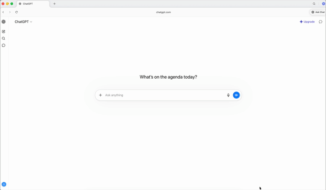

<div align="center">

# 🕺 Animato

### AIで3Dキャラクターをアニメーション化 — 自分のマシン上で、完全無料。

動きをテキストで説明する → 再生可能なアニメーションが返ってくる。<br>
**Blender不要。GPU不要。サブスク不要。アニメーション1つにつきAI推論は1回だけ。**

<br>

[](LICENSE)


<br>



<sub>🌐 <a href="README.md">English</a> · <b>日本語</b></sub>

</div>

ローカルで動作するオープンソースのツールで、静的なリグ付きモデル
（`.fbx` / `.gltf` / `.obj`）を、AIを小さなコード生成**エージェント**として使うことで
**再生可能なアニメーション**に変換します — Blenderを開くことなく、そしてLLMプロバイダーに
1円も払うことなく。

モデルをアップロードすると、サーバーがそのスケルトンを解析し、網羅的な**プロンプト**を
構築します。AIはそのプロンプトを読み、小さな`bpy`（Blender Python）スクリプトを書きます。
サーバーはそのスクリプトを**ヘッドレス**で実行し、アニメーションをファイルに焼き込みます。
AIがBlenderを実行することも、あなたのマシンに触れることも、あなたが渡したテキスト以上の
ものを見ることもありません — AIはほんの数十行のPythonを生成するだけです。

```
upload model ──► /api/prompt ──► (AI writes a bpy script) ──► /api/run executes it
                                                                      │
 web preview ◄── /public/upload/<file> ◄──────────────────────────────┘
        (same URL as the upload — now animated)
```

---

## ✨ 特長

|   | |
|---|---|
| 🆓 **本当にゼロコスト** | 無料のチャットAI（コピー＆ペースト）または無料枠のAPIキーを使えます。サブスクもクレジットカードも不要。 |
| 🧠 **大量推論ではなく1回の推論** | AIの仕事は*1つ*の短い`bpy`スクリプトを書くことだけ。クォータを食い潰すリトライループはありません。 |
| 💻 **重い処理はローカルで実行** | 読み込み・ベイク・エクスポートはすべてヘッドレスBlenderで**あなたのCPU**上で実行。Blenderのインストールは不要。 |
| 🎯 **ワンショットの正確さ** | プロンプトに完全なスケルトン・軸・単位・bpy 5.xのチートシートを同梱するので、モデルは一発で正しく生成します。 |
| 🔌 **好きなAIを使える** | Gemini、ChatGPT、Claude、DeepSeek、またはローカルのLM Studio / Ollamaモデル — Pythonを書けるものなら何でも。 |
| 👀 **three.jsによるライブプレビュー** | 内蔵エディタが、焼き込んだアニメーションをブラウザで即座に再生します。 |
| 📦 **標準フォーマットの入出力** | `.fbx`、`.gltf` / `.glb`、`.obj` — アニメーションはファイルに直接焼き込まれます。 |

---

## 📑 目次

- [クイックスタート](#-クイックスタート)
- [なぜ作ったのか](#なぜ作ったのか--aiをより少なく使う)
- [AIを動かす2つの方法](#aiを動かす2つの方法--どちらも無料)
- [仕組み](#仕組み)
- [セットアップ](#セットアップ)
- [起動](#起動)
- [APIリファレンス](#api)
- [three.jsでのプレビュー](#threejsでアニメーションをプレビューする)
- [フォーマットに関する注意](#フォーマットに関する注意)
- [コントリビュート](#コントリビュート)
- [ライセンス](#ライセンス)

---

## なぜ作ったのか — AIを*より少なく*使う

多くの「AIエージェント」ツールは、モデルを溶鉱炉のように扱います。1つのユーザープロンプトが
数十もの投機的な呼び出しに分岐し、それぞれがGPUクラスタを**5〜10分間**稼働させ続けます。
それは開発者の財布と地球の炭素予算を同時に燃やし、しかもそのほとんどが**不要**です。
プロバイダーはその習慣を喜んで補助します — 今日は呼び出しごとに損をしてでも、明日あなたを
依存させるためです。

このプロジェクトは、その正反対の賭けの上に成り立っています。

- **AIが実際に何をするかを理解する。** ここでは、AIの*全て*の仕事は1つの短いPythonスクリプトを
  書くことです。それは1回の安価な推論であり、クォータを食い潰すエージェントループではありません。
- **重い処理はローカルで行う。** モデルの読み込み、スケルトンの解析、キーフレームのベイク、
  エクスポートといった高コストな作業はすべて`bpy`を介して**あなたのCPU**上で実行されます。
  トークンは一切使いません。
- **AIには最初から全てを渡す。** プロンプトにはシーン単位、すべてのボーン、ローカル軸、
  head→tail方向、そして正しいAPIチートシートがすでに含まれています。十分な情報を与えられた
  モデルは**ワンショット**で正解するので、リトライの嵐は起きません。推論時間が短い＝サーバー
  負荷が小さい＝発熱が少ない。
- **何も払わない。** **無料のLLMウェブUI**（プロンプトを貼り付け、コードを貼り戻す）または
  **無料枠のAPIキー**を使います。サブスクもクレジットカードも不要。

> LLMは高価な共有リソースと同じように使いましょう — 慎重に、一度で、初回で答えを得られるだけの
> 十分なコンテキストとともに。

---

## AIを動かす2つの方法 — どちらも無料

有料プランは一切必要ありません。お好きな方を選んでください。

### 1. 手動 — キー不要、どんなチャットAIでも（完全無料）

1. プロンプトを構築し（`POST /api/prompt`、またはエディタの**Manual prompt**ダイアログ）、
   **コピー**します。
2. それを任意の無料AIウェブインターフェースに貼り付けます — Gemini、ChatGPT、Claude、DeepSeek、
   LM Studio / Ollama上のローカルモデルなど、すでに開いているものなら何でも。
3. 返ってきたPythonスクリプトをコピーします。
4. それを貼り戻して**実行**します（`POST /api/run`）。完了。

APIキーも課金もなし — どのみちやるコピー＆ペーストだけです。

### 2. 自動 — 無料枠のAPIキー（エージェントループ）

エディタの**Gemini AI設定**に**無料**のAPIキーを一度貼り付けます。するとアプリが往復処理を
代行します。プロンプトを構築し、モデルを呼び出し、返ってきたスクリプトを自動で実行します
（`POST /api/chat`）。Googleの`generativelanguage` APIには、たまのアニメーション作業には
十分な**無料枠**があります。キーはブラウザの`localStorage`にのみ保存され、リクエストごとに
送信されます — サーバーには決して保存されません。

> どちらの方法でも**アニメーション1つにつき推論は1回**。バックグラウンドのポーリングも、
> こっそり呼び出しを積み上げる隠れエージェントもありません。

---

## 仕組み

1. **アップロード** リグ付きモデルを `POST /api/upload`。実際に`bpy`で読み込んで検証し、
   `public/upload/` 配下に保存します。
2. **プロンプトを構築** `POST /api/prompt`。サーバーがBlenderでモデルを読み込み、AIが必要と
   する*すべて*を書き出します — シーン単位、アーマチュア、すべてのボーン（名前、親、ローカル軸、
   head→tail方向）、既存のアニメーション、さらに**bpy 5.x APIチートシート**（AIが削除済みの
   ≤3.x呼び出しを出力しないように）、そして厳密なタスク仕様。
3. **コードを生成** — 手動（任意のAIにコピー＆ペースト）または自動（無料キーで`/api/chat`）。
   プロンプトは次を満たす**1つ**の自己完結したPythonスクリプトを強制します：
   - 指定された正確なパスからモデルをインポートする、
   - ポーズボーンにキーフレームを打って動きを生成する、
   - フレーム範囲とfpsを設定する、
   - **アニメーションを焼き込んでエクスポートする**（glTFは`export_animations=True`、
     FBXは`bake_anim=True`）。**元のファイルをその場で上書き**する。
4. **実行** `POST /api/run`。サーバーがスクリプトを**別プロセス**で実行し（`bpy`のクラッシュが
   APIを巻き込まないように）、ファイルはアニメーション版で上書きされ、エンドポイントは
   `output_url` を返します。
5. **プレビュー** — エディタがそのURLをライブのthree.jsビューアで読み込み、アニメーションを
   再生します。固定（非AI）のPythonでクリップを削除することもできます
   （`POST /api/animation/remove`）。

核心となる考え方：**AIはテキストしか生成しません。** サーバーがそのテキストを`bpy`で実行して
アニメーションをモデルファイルに焼き込み、それをウェブビューアが再生します。

> **注意 — 上書きは破壊的です。** 生成されたスクリプトは、元のアップロードをアニメーション版で
> 置き換えます。AIのコードが間違っていた場合、元のファイルは失われます。再アップロードできない
> ものは必ずコピーを残しておいてください。

---

## 🚀 クイックスタート

```bash
# 1. clone
git clone https://github.com/otdnnc/animato.git
cd animato

# 2. backend deps (bpy, fastapi, …) — no Blender install needed
uv sync

# 3. build the web UI into ../public/
cd frontend && bun install && bun run build && cd ..

# 4. run everything on one origin
uv run fastapi run main.py        # ← open http://localhost:8000
```

ブラウザで：**リグ付きモデルをアップロード → 「wave hello」と入力 → 実行 → アニメーションを見る。**

> 初めての方へ？ ワンインファレンス設計については[仕組み](#仕組み)を、ホットリロードについては
> [開発モード](#開発--ホットリロード付きの2サーバー構成)をご覧ください。

---

## セットアップ

### バックエンド（Python + bpy）

Python 3.13 と [uv](https://docs.astral.sh/uv/) が必要です。`bpy`（Pythonモジュールとしての
Blender）はプロジェクトの依存関係なので、**Blenderのインストールは不要**です — venv内で
ヘッドレスに動作します。

```bash
uv sync                          # install backend deps (bpy, fastapi, ...)
```

### フロントエンド（Vite + React）

Node.js 20+ が必要です。どのパッケージマネージャでも動作します（コミット済みの`bun.lock`が
あるため [bun](https://bun.sh) が最速です）：

```bash
cd frontend
bun install                      # or: npm install
```

---

## 起動

### 本番 — 1サーバー構成（推奨）

SPAを`public/`にビルドし、FastAPIにすべて（UI + API）を単一オリジン
**http://localhost:8000** で配信させます：

```bash
# 1. build the web UI into ../public/ (keeps public/upload/ intact)
cd frontend
bun run build                    # or: npm run build

# 2. serve the API and the built UI together
cd ..
uv run fastapi run main.py       # http://localhost:8000  ← open this
```

FastAPIはビルドされた`index.html`をホームページとして配信し、`/assets/*`を配信し、
クライアントルートには`index.html`をフォールバックします（そのため`/editor`をリロードしても
動作します）。本番ビルドは**自身のオリジン**と通信するので、他に設定するものはありません。

### 開発 — ホットリロード付きの2サーバー構成

バックエンドとViteの開発サーバーを並行して起動します。開発UIは`:5173`で動作し、APIは`:8000`で
呼び出します（CORSで許可）：

```bash
# terminal 1 — backend with auto-reload
uv run fastapi dev main.py       # http://localhost:8000

# terminal 2 — Vite dev server with HMR
cd frontend
bun run dev                      # http://localhost:5173  ← open this
```

`VITE_API_URL`（例：`frontend/.env`内）でUIを別のバックエンドに向けられます：

```bash
VITE_API_URL=http://localhost:9000
```

---

## API

ベースURL：`http://localhost:8000`。アップロードおよびエクスポートされたファイルは
`/public/...` 配下で配信されます。

### `POST /api/upload`
`.fbx` / `.gltf` / `.obj` のマルチパートアップロード。`bpy`で検証し、`public/upload/` 配下に
保存します。

```bash
curl -F "file=@'public/assets/X Bot.fbx'" http://localhost:8000/api/upload
```
```json
{ "filename": "X-Bot.fbx", "size": 1234567,
  "url": "/public/upload/X-Bot.fbx",
  "absolute_url": "http://localhost:8000/public/upload/X-Bot.fbx" }
```

### `GET /api/files`
アップロード済みのすべてのモデルを一覧表示します（アップロードレスポンスと同じ形式）。

### `POST /api/prompt`
アップロード済みのモデルに対してAIアニメーション用プロンプトを構築します。

| フィールド | 型     | 意味                                                      |
|------------|--------|-----------------------------------------------------------|
| `filename` | string | `public/upload/` にすでに存在するファイル                 |
| `message`  | string | 自然言語のアニメーション要求、例：`"wave hello"`          |

```bash
curl -X POST http://localhost:8000/api/prompt \
  -H 'Content-Type: application/json' \
  -d '{"filename": "X-Bot.fbx", "message": "wave hello"}'
```

`prompt` は**任意の**AIアシスタントに貼り付けるテキストです。`output_url` はモデルのURLで、
生成されたコードがファイルをその場で上書きするため、アップロードと**同じ**になります。

### `POST /api/run`
AIが生成したbpyスクリプトを実行します。前後の ```` ```python ```` フェンスは許容されます。
別プロセスで300秒のタイムアウト付きで実行されます。

- **生テキスト**（推奨） — `Content-Type: text/plain`、ボディはスクリプトそのまま。
  エスケープ不要です。
- **JSON** — `{"code": "..."}`（改行・引用符・バックスラッシュはエスケープが必要）。

```bash
curl -X POST http://localhost:8000/api/run \
  -H 'Content-Type: text/plain' \
  --data-binary @animate.py
```
```json
{ "ok": true, "returncode": 0, "stdout": "...", "stderr": "...",
  "output_url": "/public/upload/X-Bot.fbx" }
```

**失敗した**スクリプトでもHTTP 200と`ok: false`を返します — ステータスコードではなく`ok`を
確認してください。

### `POST /api/chat`
自動パス：プロンプトを構築し、無料のLLMに送信し、返ってきたスクリプトを実行します。認証情報は
リクエストごとに渡され、**決して保存されません**。

| フィールド | 型     | 意味                                                       |
|------------|--------|------------------------------------------------------------|
| `api_key`  | string | 無料のAPIキー（エディタの設定モーダルから）                |
| `endpoint` | string | バージョンを含むAPIベース、例：`.../v1beta`               |
| `model`    | string | 例：`gemini-3-flash-preview`                              |
| `filename` | string | `public/upload/` にすでに存在するファイル                 |
| `message`  | string | アニメーション要求                                         |
| `history`  | array  | マルチターンのコンテキスト用の過去の`{role, content}`ターン |

`{code, ok, returncode, stdout, stderr, output_url}` を返します — `code` はモデルが生成した生の
スクリプトで、残りは`/api/run`と同じです。

### `POST /api/animation/remove`
アップロード済みモデルから名前付きアニメーションクリップを削除します。これは**固定の決定的な
`bpy` — AIは一切関与しません**。ファイルをその場で上書きします。

```json
{ "filename": "X-Bot.fbx", "name": "wave" }
```

> **セキュリティ：** `/api/run`（およびモデルの出力を実行する`/api/chat`）は任意のPythonを
> 実行します — これは**設計上**リモートコード実行（RCE）エンドポイントです。子プロセスでの
> 実行は`bpy`のクラッシュを隔離しますが、コードを**サンドボックス化はしません**。信頼できる
> ローカルなマシン上で使い、サンドボックスなしで公開しないでください。

---

## three.jsでアニメーションをプレビューする

エディタがすでにこれを行ってくれますが、同じ方法はどんなページでも使えます。アニメーション化
されたファイルはスキン付きスケルトン**と**焼き込まれたクリップを保持しています。フォーマットに
合ったローダーを使い（`.glb`/`.gltf`には`GLTFLoader`、`.fbx`には`FBXLoader`）、
`AnimationMixer`で駆動します。

```js
import * as THREE from 'three';
import { GLTFLoader } from 'three/addons/loaders/GLTFLoader.js';

let mixer = null;
const clock = new THREE.Clock();

new GLTFLoader().load('/public/upload/X-Bot.glb', (gltf) => {
  scene.add(gltf.scene);
  if (gltf.animations.length) {
    mixer = new THREE.AnimationMixer(gltf.scene);
    mixer.clipAction(gltf.animations[0]).play();   // loops by default
  }
});

renderer.setAnimationLoop(() => {
  if (mixer) mixer.update(clock.getDelta());        // advance the animation
  renderer.render(scene, camera);
});
```

`.fbx`には`FBXLoader`を使い（オブジェクトを直接返し、`.animations`にクリップを保持します）、
FBXはしばしばセンチメートル単位でオーサリングされている点に注意してください
（巨大に読み込まれる場合は`model.scale.setScalar(0.01)`）。

要点：

- クリップは**`.animations`**にあります — `AnimationClip`の配列です。毎フレーム
  `mixer.update(delta)`を呼ばないと、モデルはフレーム0で固まったままになります。
- ミキサーは**読み込んだルート**（`gltf.scene` / FBXの`model`）に適用します。
- `.play()`はデフォルトでループします。ワンショットには`action.setLoop(THREE.LoopOnce)`を
  使ってください。

最も単純なglTFプレビューには、Googleの`<model-viewer>`がタグ1つで`.glb`を再生します
（`<model-viewer src="…" autoplay camera-controls>`）。ただし`.fbx`は読み込めません。

---

## フォーマットに関する注意

アニメーション化されたファイルはアップロード時のフォーマットを保持します。`.glb`/`.gltf`は
ブラウザでのプレビューが最も簡単です。アニメーション化された`.fbx`も`FBXLoader`で動作します。
**`.obj`にはスケルトンがないため、アニメーション化できません。**

---

## コントリビュート

IssueやPRを歓迎します — バグ報告、新しいフォーマットのサポート、ワンショット精度を向上させる
プロンプトの調整、エディタのUXなど。変更は焦点を絞り、READMEも同期させてください。CLAは
ありません。コントリビュートすることで、あなたの成果が下記のMITライセンスの下で提供されることに
同意したものとみなされます。

---

## ライセンス

MIT。オープンソース、無料、ローカルで実行できます。🌍

<div align="center">

**Blenderのセッション、あるいはLLMの請求を1回節約できたなら、⭐ を残してもらえると嬉しいです**

<sub>AIを意図的に使うために作られました — 一度で、正しく答えを得られるだけの十分なコンテキストとともに。</sub>

</div>
